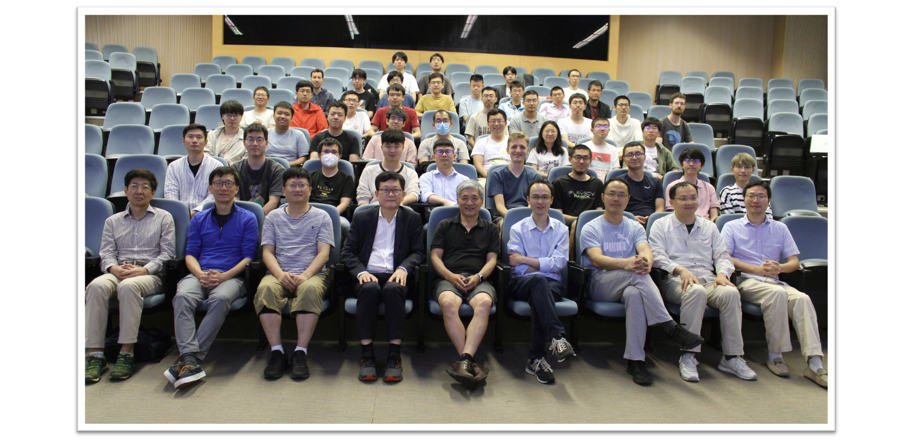
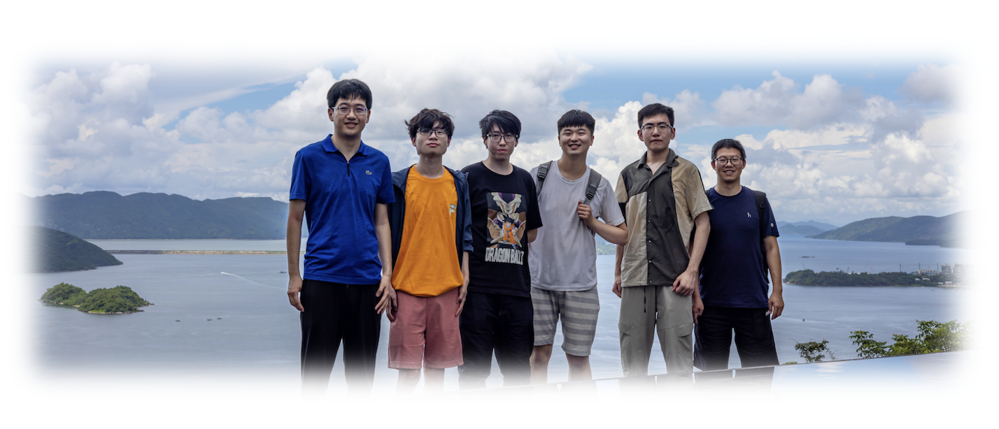

<head>
    
    
</head>

## Hong Kong Conference on Arithmetic Algebraic Geometry

_In honor of Shouwu Zhang's 60th birthday, the Chinese University of Hong Kong._

- **Time:** June 5 to 8, 2023.
- **Venue:** Yasumoto International Academic Park, LT2, CUHK.
- **Organizers:** [Xuhua He](https://www.math.cuhk.edu.hk/~xuhuahe/), [Michael McBreen](https://sites.google.com/view/mmcbreen/home), [Wei Zhang](https://math.mit.edu/~wz2113/).

### Lecture Notes (in chronological order)

**Please use with caution and do not disseminate.**

#### June 5

- **Ngaiming Mok** (HKU) -- **Abelian schemes over complex function fields and functional transcendence results**.  
_The speaker has long been interested in applications of complex geometry to number theory, and will trace the trajectory of his involvement revolving around abelian schemes over complex function fields and functional transcendence results on quotients of bounded symmetric domains._

- **Xinyi Yuan** (PKU) -- **Geometric Bombieri-Lang conjecture for finite covers of abelian varieties**. ([notes](././Yuan.pdf))  
_The Bombieri-Lang conjecture is a high-dimensional generalization of the Mordell conjecture, and it is a geometric analogue can be formulated over function fields. In a recent joint work, Junyi Xie and Xinyi Yuan prove the geometric Bombieri-Lang conjecture for finite covers of abelian varieties over function fields of characteristic zero. The goal of this talk is to introduce the result and the idea to prove it._

- **Wee Teck Gan** (NUS) -- **Relative Langlands duality via Howe duality**. ([notes](././Gan.pdf))  
_Ben-Zvi, Sakellaridis and Venkatesh recently conjectured that there is a duality phenomenon for the period problems arising in the relative Langlands program, and this should be the spectral manifestation of a duality of certain Hamiltonian varieties with group actions. In this talk, we will discuss how Howe duality allows one to verify interesting instances of this conjecture._

- **Robin Zhang** (Stanford) -- **Harris-Venkatesh plus Stark**. ([notes](././RZhang.pdf))  
_The class number formula describes the behavior of the Dedekind zeta function at $s=0$ and $s=1$. The Stark and Gross conjectures extend the class number formula, describing the behavior of Artin L-functions and p-adic L-functions at $s=0$ and $s=1$ in terms of units and class numbers. The Harris-Venkatesh conjecture describes the residue of Stark units modulo p, giving a modular analogue to the Stark and Gross conjectures while also serving as the first verifiable part of the broader Prasanna-Venkatesh conjectures. In this talk, the speaker will give a picture, formulate a unified conjecture combining Harris-Venkatesh and Stark for weight one modular forms, and describe the proof of this in the imaginary dihedral case._

#### June 6

- **Ye Tian** (MCM) -- **On Goldfeld conjecture**. ([notes](././YeTian.pdf))  
_We introduce some recent progress on distribution of 2-Selmer groups and Goldfeld conjecture for quadratic twists of elliptic curves._

- **Liang Xiao** (PKU) -- **Slopes of modular forms and ghost conjecture**. ([notes](././Xiao.pdf))  
_The p-adic valuations of the Up eigenvalues of modular forms are called the (p-adic) slopes. The study of this concept was pioneered by the work of Gouvea and Mazur. There has been many interesting conjectures in these subjects, as well as on related topics such as the global geometry of the eigencurve.  In this talk, the speaker will report on a recent joint work with Ruochuan Liu, Nha Truong, and Bin Zhao, in which we proved the so-called ghost conjecture of Bergdall-Pollack, under certain genericity condition. As a corollary, we resolve many of these conjecutres under the same hypothesis._

- **Miaofen Chen** (ECNU) -- **Harder-Narasimhan stratification in _p_-adic Hodge theory**. ([notes](././Chen.pdf))  
_We will talk about the construction of Harder-Narasimhan stratification on the $B_{\mathrm{dR}}^+$-Grassmannian and study its basic geometric properties, such as non-emptiness, dimension and relation with other stratifications, which generalizes the work of Dat-Orlik-Rapoport, Cornut-Peche Irissarry, Nguyen-Viehmann and Shen. This is a joint work in progress with Jilong Tong._

- **Yichao Tian** (MCM) -- **An prismatic-étale comparison theorem in the semi-stable case**. ([notes](././YichaoTian.pdf))  
_Various p-adic comparison theorems are important  topics in p-adic Hodge theory. In recent years, the prismatic cohomology theorem introduced by Bhatt and Scholze provide us with a uniform framework to compare various p-adic cohomology theories. In this talk, the speaker will explain a p-adic comparison theorem between the prismatic cohomology for F-crystals and the etale cohomology for local systems on semistable p-adic formal schemes over the ring of integers of a p-adic fields._

#### June 7

- **Xuhua He** (CUHK) -- **Affine Deligne-Lusztig varieties and affine Lusztig varieties**. ([notes](././He.pdf))  
_Roughly speaking, an affine Deligne-Lusztig variety describes the intersection of a given Iwahori double coset with a Frobenius-twisted conjugacy class in the loop group; while an affine Lusztig variety describes the intersection of a given Iwahori double coset with an ordinary conjugacy class in the loop group. The affine Deligne-Lusztig varieties provide a group-theoretic model for the reduction of Shimura varieties and play an important role in the arithmetic geometry and Langlands program. The affine Lusztig varieties encode the information of the orbital integrals of Iwahori-Hecke functions and serve as building blocks for the (conjectural) theory of affine character sheaves. In this talk, we will explain a close relationship between affine Lusztig varieties and affine Deligne-Lusztig varieties, and consequently, proivde an explicit nonemptiness pattern and dimension formula for affine Lusztig varieties in most cases. This talk is based on He's preprint [arXiv:2302.03203](https://arxiv.org/abs/2302.03203)._

- **Sian Nie** (AMSS) -- **Steinberg's cross-section of Newton strata**.  
_Let $G$ be a simply connected semisimple group of rank $r$ over an algebraically closed field. Steinberg has associated to each minimal length Coxeter element an $r$-dimensional affine space in $G$, which is a cross-section of all regular conjugacy classes of $G$. In this talk, we will consider natural analogues of Steinberg’s cross-sections in the context of a loop group equipped with a Frobenius automorphism. We will show how Steinberg’s cross-section intersects Frobenius twisted conjugacy classes (which are parameterized by "Newton polygons"). Some interesting applications will also be discussed._

#### June 8

- **Wei Zhang** (MIT) -- **_p_-adic heights of the arithmetic diagonal cycles on unitary Shimura varieties**. ([notes](././Zhang.pdf))  
_We formulate a p-adic analogue of the Arithmetic Gan-Gross-Prasad Conjectures for unitary groups, relating the p-adic height pairing of the arithmetic diagonal cycles to the first central derivative (along the cyclotomic direction) of a p-adic Rankin—Selberg L-function associated to cuspidal automorphic representations. In the good ordinary case we are able to prove the conjecture, at least when the ramification are mild at inert primes. We deduce some application to p-adic version of the Bloch-Kato conjecture. This is a joint work with Daniel Disegni._

- **Zhiyu Zhang** (MIT) -- **On arithmetic fundamental lemmas and arithmetic transfers**.  
_The celebrated Gross-Zagier-Zhang formula relates heights of Heegner points on Shimura curves to central derivatives of L-functions of modular forms, which has applications to the BSD conjecture of elliptic curves. As a higher dimensional generalization, the arithmetic Gan-Gross-Prasad (AGGP) conjecture relates heights of diagonal cycles on unitary Shimura varieties to central derivatives of automorphic L functions, which has applications to the Bloch-Kato conjecture of Rankin—Selberg motives. In this talk, the speaker will discuss recent developments on arithmetic fundamental lemmas (AFL) and arithmetic transfers (AT), which in particular lead to the proof of a p-adic AGGP conjecture with mild ramifications by Daniel Disegni and Wei Zhang. And the speaker will discuss his recent work where he formulate and prove the twisted AFL and some ATs, which applies to new type AGGP conjectures and Bloch-Kato conjectures._

- **Yannan Qiu** (SUSTech) -- **About the local functorial lift from a torus**.  
_Let $k$ be a local field and $T$ an $n$-dimensional torus in $\mathrm{GL}(n,k)$. It is a basic question to explicitly describe or construct the functorial lift from $T$ to $\mathrm{GL}(n,k)$. When $n=2$, such a lift can be constructed via the Weil representation. the speaker will introduce an approach to this question, with emphasis on the case $n=3$._

- **Yifeng Liu** (ZJU) -- **Anticyclotomic p-adic L-functions for Rankin-Selberg motives**. ([notes](././Liu.pdf))  
_In this talk, we will construct anticyclotomic p-adic L-functions for motives coming from conjugate-selfdual automorphic Rankin-Selberg products, for both root numbers. We will propose several conjectures concerning such p-adic L-functions and explain certain progress toward one of them, namely, one-side divisibility of a corresponding Iwasawa main conjecture._

