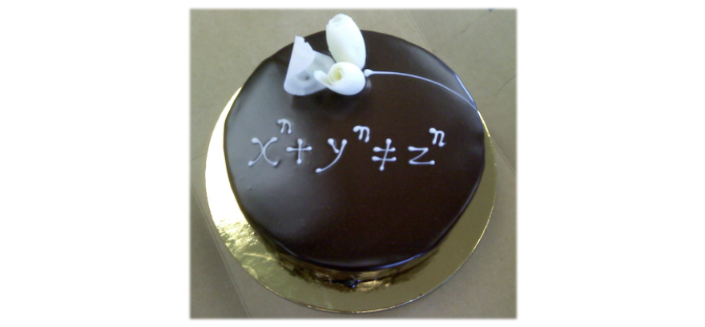

## Courses on Fermat's Last Theorem

_Topics in Number Theory (I), 2020 Fall_

The original (official) course page is moved [here](http://www.bicmr.pku.edu.cn/~lxiao/2020fall/2020fall.htm).

The focus of this course will be on understanding the Langlands correspondence for modular forms and the Taylor-Wiles method. The course consists of 4 parts:
  - We review basic facts on structures of Galois group of local and global number fields, and discuss Galois cohomology and duality theorems.
  - We discuss deformation of Galois representations, local and global.
  - We shift to discuss modular forms and associated Galois representations.
  - We prove a modularity lifting theorem, through which we deduce Fermat's Last Theorem.

### Logistics
- **Lecturer:** [Liang Xiao](http://faculty.bicmr.pku.edu.cn/~lxiao/index.htm) / 肖梁.
- **Time:** Monday 1-2, Wednesday 7-8 (even week).
- **Venue:** Lecture Building #3, Room 206 (三教206).
- **Office Hours:** Friday 10-11am at BICMR 75101-1 (in the BICMR, Jingchun Yuan)

**IMPORTANT:** All the lecture videos are hosted at Liang Xiao's [bilibili website](https://www.bilibili.com/video/BV17y4y127sG/).

### List of Assignments

#### Homeworks:
- [**Homework 1**](././Exercise1.pdf) - [solution](././Exercise1-soln.pdf);
- [**Homework 2**](././Exercise2.pdf) - [solution](././Exercise2-soln.pdf);
- [**Homework 3**](././Exercise3.pdf) - [solution](././Exercise3-soln.pdf);
- [**Homework 4**](././Exercise4-prim.pdf) (a primitive version, see also the [most current version](././Exercise4.pdf)) - [solution](././Exercise4-soln.pdf);
- [**Homework 5**](././Exercise5.pdf) - [solution](././Exercise5-soln.pdf);
- [**Homework 6**](././Exercise6.pdf) - [solution](././Exercise6-soln.pdf).

#### The take-home final exam:

The goal of this [final exam](././final-exam.pdf) is to prove the **level raising theorem**, which is quite similar to Ribet’s level lowering theorem, under some technical assumptions. (Here comes [an incomplete solution](././final-soln.pdf) by Wenhan)

### Course Schedule

_We obtain a [pdf version](././syllabus0.pdf) of course syllabus. But the course schedule is subject to change._

- [x] (9/21) **Lecture 1:** Introduction and Background in Number Theory I -- _l_-adic representations of local Galois group, structure of local Galois group. ([notes](././Lecture1.pdf), [video](https://www.bilibili.com/video/BV17y4y127sG?p=1))

- [x] (9/28) **Lecture 2:** Background in Number Theory II -- Grothendieck's _l_-adic monodromy theorem, Weil--Deligne representations, higher ramification groups, local class field theory in terms of Artin maps. ([notes](././Lecture2.pdf), [video](https://www.bilibili.com/video/BV17y4y127sG?p=2))

- [x] (9/30) **Lecture 3:** Background in Number Theory III -- Global class field theory, Galois cohomology. ([notes](././Lecture3.pdf), [video](https://www.bilibili.com/video/BV17y4y127sG?p=3))
  - a [comment](././comment1.pdf) on Artin map.
  - a [short note](././comment2.pdf) on congruent subgroups of units in number field.

- [x] (10/12) **Lecture 4:** Background in Number Theory IV -- Local duality theorems for Galois cohomology. ([notes](././Lecture4.pdf), [video](https://www.bilibili.com/video/BV17y4y127sG?p=4))
  - [more details](././comment3.pdf) on the proof of local Tate duality.
  - a [short note](././comment4.pdf) on first Galois cohomology and extensions of representations.

- [x] (10/14) **Lecture 5:** Background in Number Theory V -- Global duality theorems for Galois cohomology. ([notes](././Lecture5.pdf), [video](https://www.bilibili.com/video/BV17y4y127sG?p=5)) ([Homework 1](././Exercise1.pdf) due)

- [x] (10/19) **Lecture 6:** Overflow material from duality theorems. ([notes](././Lecture6.pdf), [video](https://www.bilibili.com/video/BV17y4y127sG?p=6))

- [x] (10/26) **Lecture 7:** Galois deformation I -- Framed deformation, computation of tangent space. ([notes](././Lecture7.pdf), [video](https://www.bilibili.com/video/BV17y4y127sG?p=7)) ([Homework 2](././Exercise2.pdf) due)

- [x] (10/28) **Lecture 8:** Galois deformation II -- Quotient by free actions, existence of deformation ring. ([notes](././Lecture8.pdf), will not cover first two pages, [video](https://www.bilibili.com/video/BV17y4y127sG?p=8))

- [x] (11/2) **Lecture 9:** Galois deformation III -- Relations of deformation rings, and some examples. ([notes](././Lecture9.pdf), [video](https://www.bilibili.com/video/BV17y4y127sG?p=9))

- [x] (11/9) **Lecture 10:** Galois deformation IV -- Relative deformation problem, Galois deformation with local conditions, more examples. ([notes](././Lecture10.pdf), [video](https://www.bilibili.com/video/BV17y4y127sG?p=10))
- [x] (11/11) **Lecture 11:** Galois deformation IV -- Taylor-Wiles primes and Galois patching. ([notes](././Lecture11.pdf), [video](https://www.bilibili.com/video/BV17y4y127sG?p=11)) ([Homework 3](././Exercise3.pdf) due)
- [x] (11/16) **Lecture 12:** Galois deformation V -- Conditioned local Galois deformation. ([notes](././Lecture12.pdf) for Lecture 12-13, [video](https://www.bilibili.com/video/BV17y4y127sG?p=12))

- [x] (11/23) **Lecture 13:** Galois deformation VI -- Conditioned local Galois deformation at _l_≠_p_. (Xiao's away, watch the lecture [video](https://www.bilibili.com/video/BV17y4y127sG?p=13) here.)

- [x] (11/25) **Lecture 14:** _p_-adic Hodge theory I -- A quick overview. (Xiao's away, watch the lecture [video](https://www.bilibili.com/video/BV17y4y127sG?p=14) here, [notes](././Lecture14.pdf) for Lecture 14-15.)

- [x] (11/30) **Lecture 15:** _p_-adic Hodge theory II -- Fontaine-Laffaille deformation. (Xiao's called sick, watch the lecture [video](https://www.bilibili.com/video/BV17y4y127sG?p=15) here) 

- [x] (12/7) **Lecture 16:** Galois representations appearing in geometry. ([notes](././Lecture16.pdf), [video](https://www.bilibili.com/video/BV17y4y127sG?p=16)) ([Homework 4](././Exercise4.pdf) due)

- [x] (12/9) **Lecture 17:** Modular forms I -- Jacobian of curves. ([notes](././Lecture17.pdf), [video](https://www.bilibili.com/video/BV17y4y127sG?p=17))

- [x] (12/14) **Lecture 18:** Modular forms II -- Galois representations attached to modular forms. ([notes](././Lecture18.pdf), [video](https://www.bilibili.com/video/BV17y4y127sG?p=18))

- [x] (12/21) **Lecture 19:** Modular forms III -- Geometric modular forms. ([notes](././Lecture19.pdf), [video](https://www.bilibili.com/video/BV17y4y127sG?p=19))

- [x] (12/23) **Lecture 20:** Modular forms IV -- Eichler-Shimura relations. ([notes](././Lecture20.pdf), [video](https://www.bilibili.com/video/BV17y4y127sG?p=20)) ([Homework 5](././Exercise5.pdf) due)

- [x] (12/28) **Lecture 21:** Modularity lifting theorem I -- preparation. ([notes](././Lecture21.pdf), [video](https://www.bilibili.com/video/BV17y4y127sG?p=21))

- [x] (1/4) **Lecture 22:** Modularity lifting theorem II -- patching argument. ([notes](././Lecture22.pdf), [video](https://www.bilibili.com/video/BV17y4y127sG?p=22))

- [x] (1/6) **Lecture 23:** Modularity lifting theorem III -- Wiles' 3-5 trick and finish of the proof. ([notes](././Lecture23.pdf), [video](https://www.bilibili.com/video/BV17y4y127sG?p=23)) ([Homework 6](././Exercise6.pdf) due)

### References

An certainly incomplete list of references:
1. Various lecture notes by Richard Taylor, for example [this](https://www.mit.edu/~fengt/249A_2018.pdf) more recent one (notes by Dan Dore and Tony Feng).
2. Bockle's lecture notes in the collection [Deformation of Galois Representations](https://link.springer.com/chapter/10.1007/978-3-0348-0618-3_2).
3. [Sug Woo Shin's course](https://gauss.math.yale.edu/~rz289/Galois_reps.pdf) at Berkeley (notes taken by Rong Zhou).
4. [Toby Gee's notes](https://wwwf.imperial.ac.uk/~tsg/Index_files/ArizonaWinterSchool2013.pdf) at Arizona Winter School.
5. 2009-2010 [Stanford seminar](https://math.stanford.edu/~conrad/modseminar/) on modularity lifting theorems.
6. [Kisin's notes](https://www.claymath.org/sites/default/files/kisin.pdf) on deformation of Galois representations.

