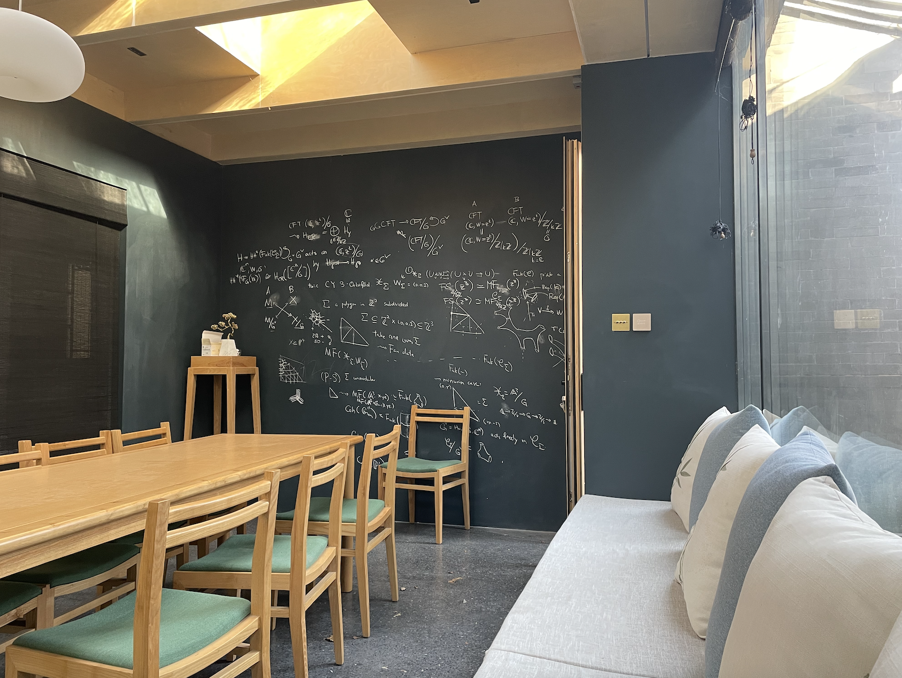
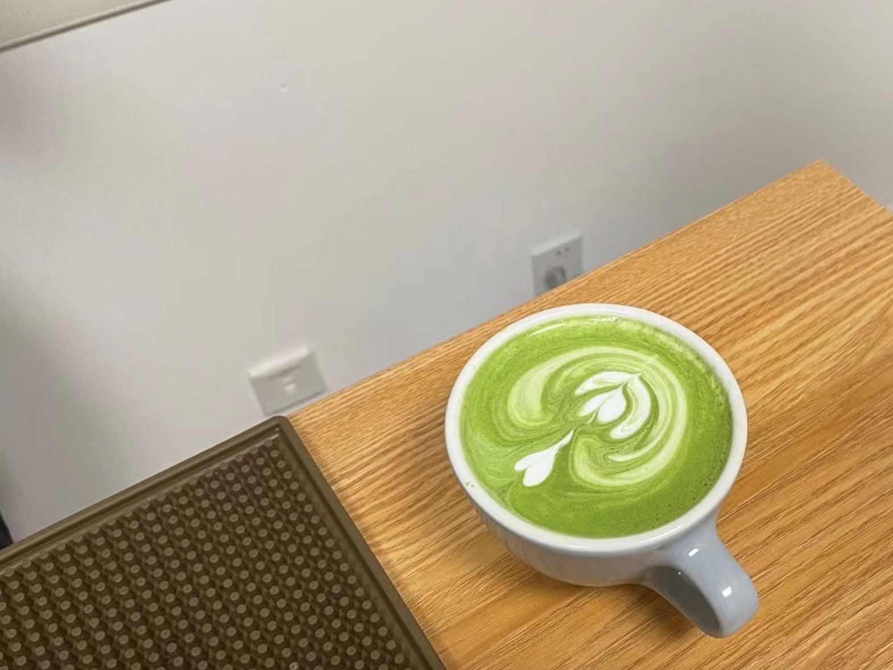

## On the Ternary Goldbach Problem.

_A coffee-break-seminar on additive and combinatoric number theory._

**Motivation:** The coffee bar at BICMR is used for resting or discussing problems and is equipped with comfortable sofas and wide blackboards. For tired students, this place (and especially the sofas) is extremely attractive. However, it is embarrassing to occupy the sofa for long periods of time without doing mathematics; and to make matters worse, both automorphic forms on Shimura varieties and _p_-adic Hodge theory are so difficult that tired students no longer have the energy to discuss them. So, to better occupy the comfort of the sofa, we came up with the idea of discussing Goldbach's Conjecture (so that people passing through the corridor wouldn't get the idea of chasing us away).

All over the world, there are a large number of amateur maths enthusiasts who make their own elementary and non-professional attempts at all kinds of number-theoretic conjectures. In the case of the Goldbach Problem, this phenomenon is more evident in China than elsewhere for historical reasons. This series of discussions, which took place during the coffee break, was intended to explain why the Goldbach Problem is so difficult to prove and the great difficulties that lie beneath its elementary appearance.

- **Organizers:** Zekun Chen (<chenzekun@pku.edu.cn>), Wenhan Dai (me), and Sister Xiao (<944058846@qq.com>).
- **Time:** October-November 2022; typically irregular. (Contact the organizers to join the WeChat group for detailed time syllabus.)
- **Venue:** Coffee Bar at Jingchun Yuan (behind Room 77201), BICMR; or alternatively, the Paradiso Coffee (泊星地咖啡) at Yan Yuan.
- **Prerequisite:** Analytic NT / Fourier analysis, assumedly useful but not necessary. 

We plan to follow [Ben Green's lecture notes](https://courses-archive.maths.ox.ac.uk/node/view_material/49404) (Oxon ver in 2020) closely.

### Contents

The content is divided into two (mostly disjoint) parts: Additive Number Theory and Additive Combinatorics.

#### Part A
1. Introduction and preliminaries ([notes](././ACNT1.pdf)) -  
   Highlights of the course, Landau and Vinogradov notation, preliminaries on Fourier transforms.
2. Sums of two squares ([notes](././ACNT2.pdf)) -  
   Sums of squares, proof of Fermat's theorem and Lagrange's theorem, sums of three squares, etc..
3. Waring’s problem and the circle method ([notes](././ACNT3.pdf)) -  
   Waring's problem, asymptotic formula, the Hardy-Littlewood circle method, major arcs and minor arcs.
4. Waring’s problem: the minor arcs. ([notes](././ACNT4.pdf)) -  
   Minor arcs, Weyl sums, Vinogradov's lemma with proof, proof of Weyl sum estimate.
5. Gauss sums and integrals. ([notes](././ACNT5.pdf)) -  
   ?
6. Major arcs (I). ([notes](././ACNT6.pdf))
7. Major arcs (II). ([notes](././ACNT7.pdf))
8. Singular series. ([notes](././ACNT8.pdf))

#### Part B
9. Sumset estimates and Ruzsa’s covering lemma. ([notes](././ACNT9.pdf))
10. Plünnecke–Ruzsa inequality. ([notes](././ACNT10.pdf))
11. Freiman homomorphisms and Ruzsa’s model lemma. ([notes](././ACNT11.pdf))
12. Freiman’s theorem. ([notes](././ACNT12.pdf))
13. Roth’s theorem (I). ([notes](././ACNT13.pdf))
14. Roth’s theorem (II). ([notes](././ACNT14.pdf))

#### Part C
About the Goldbach Problem. Have not been determined yet. 

