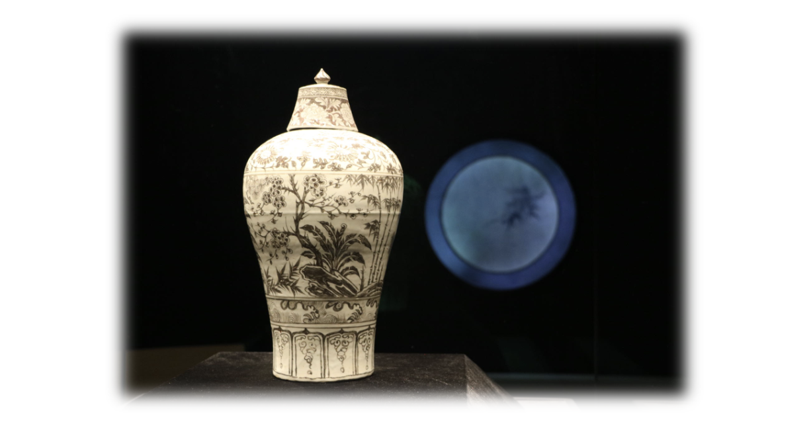

<head>
    
    
</head>

## The 5th _Kyoto+_ Conference on Algebraic Geometry and Arithmetic Geometry at Nanjing

_By Arithmetic & Homotopic Galois Theory, a France-Japan international network._

- **Time:** August 24 to 28, 2023.
- **Venue:** Yifu Hall, Nanjing University Gulou / 南京大学鼓楼校区逸夫馆.
- **Organizers:** Yuichiro Hoshi (RIMS, Kyoto), Zhi Hu (NJUST, Nanjing), Pengfei Huang (Universität Heidelberg, Heidelberg), Yu Yang (RIMS, Kyoto), Runhong Zong (NJU, Nanjing).

### Lecture Notes (in chronological order)

**Some slides of online speakers are exclusive.**

#### August 24

- **Yiwen Ding** (Peking Univ.) -- **The geometry of Bernstein eigenvarieties**. ([notes](././Ding.pdf))  
_Bernstein eigenvarieties are rigid analytic spaces parametrizing certain p-adic automorphic representations. Generalizing the work of Breuil-Hellmann-Schraen, we show that the geometry of Bernstein eigenvarieties is closely related to the generalized (parabolic) Grothendieck-Springer resolution. As an application, we prove a classicality result (in the Fontaine-Mazur style) of points on Bernstein eigenvarieties. This is a joint work with Christophe Breuil._

- **Li Cai** (Capital Normal Univ.) -- **On the Archimedean arithmetic smooth matching**. ([slides](././Cai.pdf))  
_We will firstly talk about the relative trace formula approach to the Gross-Zagier formula, especially the Archimedean arithmetic smooth matching. Then we discuss a general problem reducing the semi-global comparison to the local one. The talk is based on two joint works: one with Ye Tian, Xinyi Yuan and Wei Zhang, and the other one with Ye Tian._

- **Shizhag Li** (AMCC) -- **On cohomology of** $B^nG$. ([notes](././Li.pdf))  
_We’ll discuss the de Rham or crystalline or prismatic cohomology of BnG where G is a finite locally free commutative group scheme over a suitable base so that these cohomologies make sense. We will see that these cohomologies “want to be” (but not quite) derived augmented divided power algebra freely generated by Dieudonné module of G in degree (n+1). This is an ongoing joint work with Dmitry Kubrak and Shubhodip Mondal._

- **Emanuel Rienecke** (MPIM-Bonn) -- **Unipotent homotopy theory of schemes**. ([notes](././Reinecke.pdf))  
_In this talk, we will present a notion of unipotent homotopy theory for schemes, which is based on Toen’s work on affine stacks. we will discuss some general properties of the resulting unipotent homotopy group schemes and explain how over a field of characteristic p > 0, they often recover the unipotent completion of the Nori fundamental group scheme, p-adic etale homotopy groups, and Artin-Mazur formal groups. As examples, we will see computations in the case of curves, abelian varieties, and Calabi-Yau varieties. Joint work with Shubhodip Mondal._

#### August 25

- **Yuchen Liu** (Northwestern) -- **Wall crossing for _K_-moduli spaces**. ([notes](././YuchenLiu.pdf))  
_Recent developments in K-stability provide a nice moduli space, called a K-moduli space, for log Fano pairs. When the coefficient of the divisor varies, these K-moduli spaces demonstrate wall crossing phenomena. In this talk, we will discuss the general principle of K-moduli wall crossings, and show in examples that it provides a bridge connecting various moduli spaces of different origins, such as GIT, KSBA, and Hodge theory. Based on joint works with Kenny Ascher and Kristin DeVleming._

- **Burt Totaro** (UCLA) -- **Endomorphisms of varieties**. ([notes](././Totaro.pdf))  
_A natural class of dynamical systems is obtained by iterating polynomial maps, which can be viewed as maps from projective space to itself. One can ask which other projective varieties admit endomorphisms of degree greater than 1. This seems to be an extremely restrictive property, with all known examples coming from toric varieties (such as projective space) or abelian varieties. We describe what is known in this direction, with the new ingredient being the “Bott vanishing” property. Joint work with Tatsuro Kawakami._

- **Janos Kollár** (Princeton) -- **What determines an algebraic variety?**  
_We discuss how to describe the sheaf theory of an algebraic variety, if we are given only the underlying Zariski topological space. (Joint work with Max Lieblich, Martin Olsson and Will Sawin)._

- **Chenyang Xu** (Princeton) -- **Higher rank finite generation**.  
_Finite generation for higher rank quasi-monomial valuation plays a key role in K-stability theory of Fano varieties. It is the main step to establish the “compactedness”. In this talk, we want to outline our proof of it. The talk is based on joint works with Yuchen Liu and Ziquan Zhuang._

#### August 26

- **Bin Zhao** (Capital Normal Univ.) -- **Slopes of modular forms and geometry of eigencurves**.  
_In this talk, we will report my recent joint work with Ruochuan Liu, Nha Xuan Truong and Liang Xiao on the ghost conjecture, which gives an effective algorithm to compute the p-adic slopes of certain eigenforms. we will then explain the applications of our work to the study of Galois representations and eigencurves. If time allows, we will also discuss the potential generalizations of ghost conjecture._

- **Koji Shimizu** (YMSC) -- **Moduli stacks of crystals and isocrystals**. ([notes](././Shimizu.pdf))  
_To a smooth projective curve over a finite field, we associate rigid-analytic moduli stacks of isocrystals together with the Verschiebung endomorphism. We discuss the first examples and properties of such objects. This is a joint work in progress with Gyujin Oh._

- **Jilong Tong** (Capital Normal Univ.) -- **Harder-Narasimhan stratification in _p_-adic Hodge theory**.  
_We will construct the Harder-Narasimhan stratification on the de Rham $B^+$-Grassmannian and study its basic geometric properties, such as non-emptiness, dimension and relation with other stratifications. This generalizes the work of Dat-Orlik-Rapoport, Cornut-Peche Irissarry, Nguyen-Viehmann and Shen. This is a joint work in progress with Miaofen Chen._

- **Deding Yang** (Peking Univ.) -- **Ampleness of automorphic line bundles over Hilbert modular varieties and some generalizations**.  
_We will talk about an ampleness criterion of line bundles on special fibers of unitary Shimura varieties to solve a conjecture proposed by Tian-Xiao. We will also talk about its generalizations to the flag space over some unitary Shimura varieties._

#### August 27

- **Xinyi Yuan** (Peking Univ.) -- **Recent development of uniform Mordell conjecture**. ([notes](././Yuan.pdf))  
_This talk will introduce some recent progresses on the uniform Mordell conjecture over global fields by Dimitrov-Gao-Habegger, Kuhn, Yuan, Looper-Silverman-Wilms, and Yu._

- **Carlos Simpson** (CNRS and Université Côte d’Azur) -- **The Donagi-Pantev program for geometric Langlands on a curve of genus 2**. ([notes](././Simpson.pdf))  
_Let X be a Riemann surface. To a representation of the fundamental group, the geometric Langlands correspondence associates a perverse sheaf on the moduli space Bun of vector bundles. This perverse sheaf yields a representation of the fundamental group of a Zariski open subset of Bun. Ron Donagi and Tony Pantev made conjectures and initiated a program of analyzing this relationship using the nonabelian Hodge correspondence between Higgs bundles and representations of fundamental groups. Their picture is related to the “electro-magnetic duality” of Kapustin and Witten. We’ll explain the Donagi-Pantev program, its relation to the nonabelian Hodge correspondence, and then discuss our current work on this project for the case of rank 2 local systems on a curve of genus 2._

- **Junliang Shen** (Yale) -- **Perverse filtrations, compactified Jacobians, and Hitchin systems**. ([notes](././Shen.pdf))  
_The cohomology of the Hitchin moduli space exhibits striking similarities to the cohomology of the compactified Jacobian of a curve with a planar singularity. Remarkably, both cohomology groups possess perverse filtrations. In the Hitchin scenario, the P = W conjecture, which has now been established as a theorem, establishes a link between the perverse filtration and the mixed Hodge structure of the corresponding character variety through the non-abelian Hodge theory. In the Jacobian case, the OblomkovRasmussen-Shende conjecture predicts a connection between the perverse filtration and the link of the curve singularity. In this talk, we will delve into a unified approach aimed at undastanding the perverse filtrations in both cases. This approach not only offers a proof of the P=W conjecture but also establishes the multiplicativity of the perverse filtration of a compactified Jacobian, thereby generalizing a theorem of Oblomkov-Yun. Based on ongoing joint work with Davesh Maulik and Qizheng Yin._

#### August 28

- **Yifeng Liu** (Zhejiang Univ.) -- **Selmer theta lifts**.  
_We construct Kudla’s generating functions valued in Selmer groups, and prove its modularity under certain conditions. We then define Selmer theta lifts and compute their p-adic heights, which can be regarded as a p-adic analogue of the arithmetic inner product formula._

- **Yichao Tian** (MCM) -- **A prismatic-étale comparison theorem in the semi-stable case**. ([notes](././Tian.pdf))  
_Various p-adic comparison theorems are important topics in p-adic Hodge theory. In recent years, the prismatic cohomology theorem introduced by Bhatt and Scholze provide us with a uniform framework to compare various p-adic cohomology theories. In this talk, we will explain a p-adic comparison theorem between the prismatic cohomology for F-crystals and the étale cohomology for local systems on semistable p-adic formal schemes over the ring of integers of a p-adic fields._

