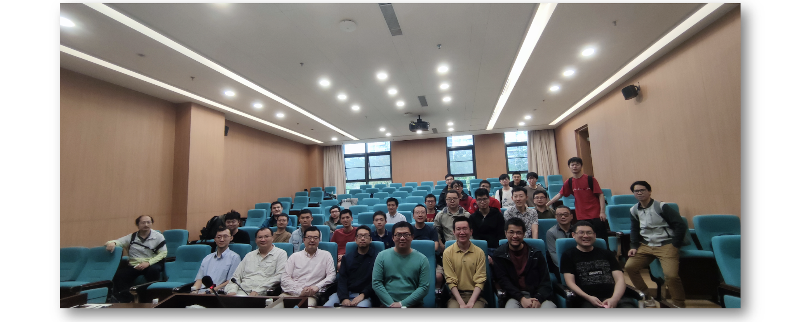
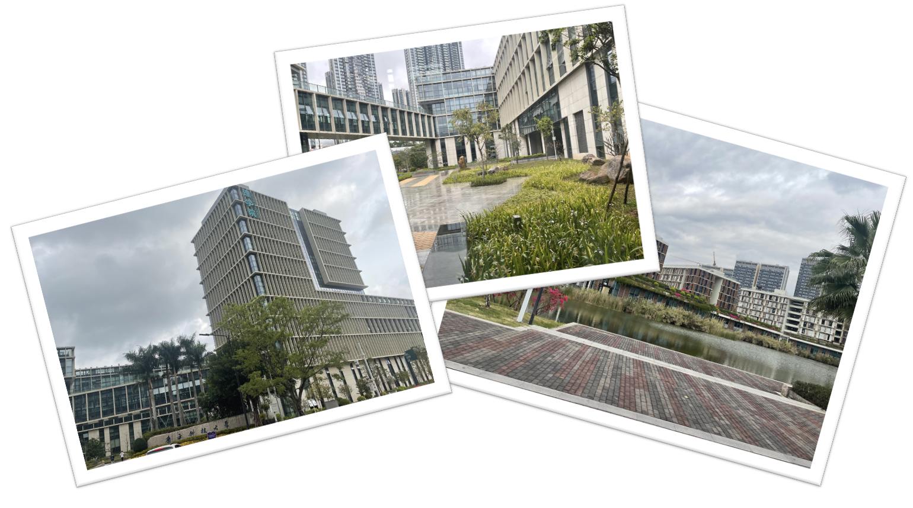

<head>
    
    
</head>

## Shenzhen Workshop on Arithmetic Geometry.

_Department of Mathematics at SUSTech - [Southern University of Science and Technology](https://math.sustech.edu.cn/conference/12651.html)_

See pdf version of [conference handbook](././handbook.pdf).

- **Time:** March 24 to 26, 2023.
- **Venue:** Dept. of Mathematics at SUSTech, Shenzhen.
- **Organizers:** [Hui Gao](https://huigaomath.github.io/), [Yong Hu](https://math.sustech.edu.cn/c/huyong?lang=en), [Yannan Qiu](https://math.sustech.edu.cn/c/qiuyannan?lang=en).

### Lecture Notes (in chronological order)

**Please use with caution and do not disseminate.**

#### March 24

- **Weizhe Zheng** (MCM) -- **Étale cohomology and ultraproducts**. ([article](https://link.springer.com/article/10.1007/s00229-020-01234-x), [notes](././Zheng.pdf))  
_The ultraproduct of étale cohomology provides a family of Weil cohomology theories of algebraic varieties, whose properties are closely related with the torsion-freeness and independence of $\ell$ for $\ell$-adic cohomologies. This talk reports some recent progresses in research of ultraproduct cohomology._

- **Xu Shen** (MCM) -- **_F_-zips with additional structure on splitting models of Shimura varieties**. ([article](https://arxiv.org/abs/2212.13763))  
_We will talk about constructions on certain mod p Hodge structure for the smooth Pappas-Rapoport splitting models of Shimura varieties. These integral models are resolutions of singularities of the corresponding canonical models for ramified groups. We will also discuss applications to Galois representations associated to torsion classes in coherent cohomology. This is a joint work with Yuqiang Zheng._

- **Chuangxun Cheng** (NJU) -- **On the image of Galois representations attached to modular forms**. ([preprint](././Cheng.pdf), in preparation)   
_In this presentation, starting with the results of Swinnerton-Dyer on the congruences of Fourier coefficients of modular forms (small image case) and the results of Serre on the image of Galois representations attached to elliptic curves (big image case), we explain two applications of Galois representations in the study of Fourier coefficients of modular forms._

- **Chunyin Hui** (CUHK) -- **Monodromy of subrepresentations and irreducibility of low degree automorphic Galois representations**. ([notes](././Hui.pdf))  
_Given a compatible system $(\rho_{\lambda})$ of semisimple $\lambda$-adic Galois representations of a number field $K$ satisfying mild local conditions, we prove that for almost all $\lambda$, any type A irreducible subrepresentation of the $\ell$-adic descent of $\rho_{\lambda}$ is residually irreducible. We apply this result and some potential automorphy theorem to prove that those are residually irreducible for almost all $\lambda$ if the compatible system is attached to a regular algebraic, polarized, cuspidal automorphic representation of $\mathrm{GL}_{n}(\mathbb{A})$ and $n\leqslant 6$._

#### March 25

- **Daxin Xu** (MCM) -- **Drinfeld lemma for _F_-isocrystals**. ([article](https://arxiv.org/abs/2210.14872), [notes](././Xu.pdf))  
_Drinfeld's lemma for $\ell$-adic local systems is a fundamental result in arithmetic geometry. It plays an important role in the Langlands correspondence for a reductive group over the function field of a curve over a finite field, pioneered by Drinfeld for GL(2) and subsequently extended by L. Lafforgue and then V. Lafforgue. In this talk, we will discuss Drinfeld's lemma for p-adic local systems: overconvergent/convergent F-isocrystals. This is based on a joint work with Kiran Kedlaya._

- **Caihua Luo** (CUHK Shenzhen) -- **Singularity of intertwining operators and some applications**. ([article](https://arxiv.org/abs/2112.03531), [notes](././Luo.pdf))  
_Intertwining operators play an important role in the Langlands program, e.g. their relations with constructing automorphic L-functions. The singularity of those operators is a basic problem. For generic co-rank one generalized principal series, it is characterized by the pole of some Langlands-Shahidi L-functions. While for generic standard modules, an explicit conjecture was proposed by Casselman-Shahidi about 20 years ago. In this talk, we will present a method to partially answer the singularity problem, especially the aforementioned conjecture. If time permits, we will also discuss some applications._

- **Heng Xie** (Sun Yat-Sen Univ) -- **_I_-cohomology of Grassmannians**. ([notes](././Xie.pdf))  
_I-cohomology is a version of the singular cohomology in the real algebraic geometry. It is an important part of the Chow-Witt group, which contains obstruction classes for splitting vector bundles. This talk considers computations about I-cohomology of Grassmannians._

- **Enlin Yang** (PKU) -- **Conductor formulas for motivic spectra** ([article I](https://www.ams.org/journals/tran/2020-373-10/S0002-9947-2020-08187-2/S0002-9947-2020-08187-2.pdf), [article II](https://arxiv.org/abs/2209.11086), [article III](https://arxiv.org/abs/2211.10985), [notes](././Yang.pdf))  
_This talk begins with making a survey on conductor formulas for constructible etale sheaves. Then it introduces a quadratic version of Bloch’s conductor formula, which is formulated in collaboration with Fangzhou Jin._

- **Fangzhou Jin** (Tongji Univ) -- **The quadratic Artin conductor of a motivic spectrum**. ([article](https://arxiv.org/abs/2211.10985), [notes](././Jin.pdf))  
_We define the quadratic Artin conductor of a motivic spectrum over a smooth scheme under some assumptions, and use it to prove a quadratic refinement of the Grothendieck-Ogg-Shafarevich formula. This is a joint work with Enlin Yang._

#### March 26

- **Jinbo Ren** (Xiamen Univ) -- **Group-theoretical applications of Diophantine approximation**. ([article](https://link.springer.com/article/10.1007/s00222-021-01064-y))  
_An abstract group $\Gamma$ is called boundedly generated if it can be written as the product of finitely many cyclic subgroups, i.e. $\Gamma=\langle g_1\rangle \cdots \langle g_r\rangle$. This notion applies widely in the theory of arithmetic groups, for example, for rigidity property, the congruence subgroup problem, Kazhdan property (T), etc.. We show that over a characteristic 0 field, a linear group is boundedly generated via semisimple elements if and only if it is virtually abelian. In particular, over a number field, arithmetic subgroups of some anisotrypic algebraic group is not boundedly generated. Moreover, we can deduce that a set that can be boundely generated by semisimple elements has growth rate equal to $c(\log T)^s$ with respect to height, where $T$ denotes the height function. The proof deeply uses subspace theorem in Diophantine approximation and generic element theory in Galois theory. This is a joint work with Corvaja, Demeio, Rapinchuk, and Zannier._

- **Zhiyu Tian** (PKU) -- **Local-global principle, integral Tate conjecture, and algebraic equivalence**. ([article I](https://arxiv.org/abs/2211.15915), [article II](https://arxiv.org/abs/2302.07069))  
_The talk is about the recent results about local-global principles for zero cycles and rational points on geometrically rational surfaces defined over global function fields, which is deduced from certain integral version of the Tate conjecture for some classes of varieties over finite fields. The key ingredient is a new geometric understanding of algebraic equivalence of one cycles on smooth projective varieties that has been recently obtained in a joint work with János Kollár._

