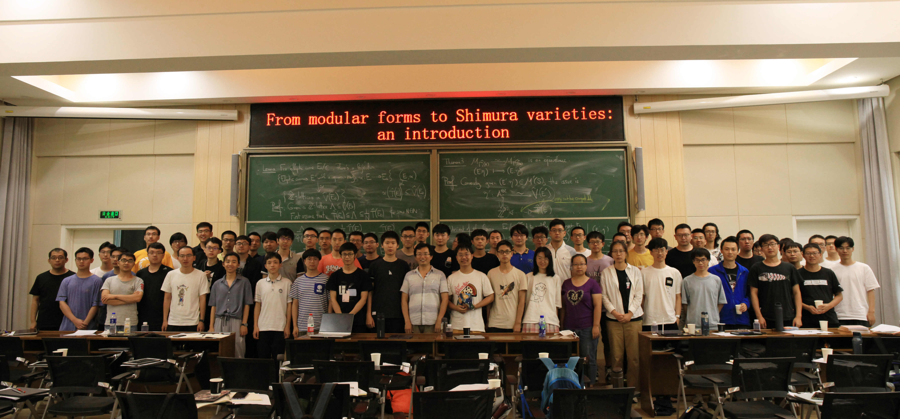

## From Modular Forms to Shimura Varieties

The purpose of this week-long program is to discuss basics of Shimura varieties, start- ing from more familiar concepts such as modular forms and modular curves, passing through their automorphic interpretations, to the concept of Shimura varieties. The program will consist of ten lectures, each accompanied with a set of exercises for discussion and for the students to better absorb the new material.
- **Lecturer:** [Liang Xiao](https://bicmr.pku.edu.cn/~lxiao/index.htm).
- **Dates:** July 26–30, 2021.
- **Place:** BICMR, Peking University; room 甲乙丙报告厅.

### A typical day of the program:

- 9:00-11:00 Lecture;
- 11:15-12:15 Problem Session;
- 12:15-13:30 Lunch;
- 13:30-15:30 Lecture;
- 15:30-16:00 Tea Break;
- 16:00-17:00 Problem Session.

### A tentative plan for the ten lectures:

**Prerequisite:** Modular forms, Algebraic Number Theory, and Algebraic Geometry. (For étale cohomology, it does not hurt to view it as usual topological cohomology together with a Galois action.)

_A primitive version of syllabus: [pdf file](././syllabus.pdf). This is slightly different from the following._

See the [exercise sheet](././exercises.pdf) for lecture 1-8. (Unfortunately, the lecturer eventually lost energy to provide more exercises for lecture 9-10.)

1. Adelic interpretation of modular forms and automorphic representations. ([notes](././n1.pdf), [handout](././1.pdf))
2. Representations over local fields, nonarchimedean and archimedean. ([notes](././n2.pdf), [handout](././2.pdf))
3. (g,K)-modules. ([notes](././n3.pdf), [handout](././3.pdf))
4. Geometric modular forms, Kodaira–Spencer isomorphism, Eichler–Shimura isomorphism. ([notes](././n4.pdf), [handout](././4.pdf))
5. Tate curves, Gauss-Manin connection. ([notes](././n5.pdf), [handout](././5.pdf))
6. Galois representations associated to modular forms. ([notes](././n6.pdf), [handout](././6.pdf))
7. Siegel modular varieties, Shimura varieties of PEL type. ([notes](././n7.pdf), [handout](././7.pdf))
8. General theory of Shimura varieties. ([notes](././n8.pdf), [handout](././8.pdf))
9. Automorphic bundles on Shimura varieties. ([notes](././n9.pdf), [handout](././9.pdf))
10. Cohomology of automorphic vector bundles and étale cohomology of Shimura varieties. ([notes](././n10.pdf), [handout](././10.pdf))

