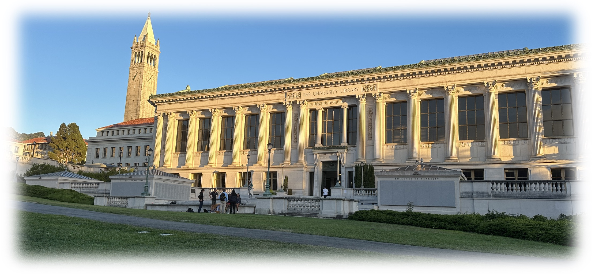

_Last update on: September, 2025._

Hi! 

- [**About Me**](./index.md)
- [**Papers and Notes**](./blurbs.md)
- [**Teaching and Services**](./teaching.md)
- [**Conference & Seminar Archives**](./activities.md)

 

## Conference & Seminar Activities

#### 2024 Summer

- [**The Los Angeles Workshop on Representations and Geometry**](./BZSV/LAWRGE.md).  
  _The follow-up event to the Minnesota summer school and workshop. Containing Problem sessions for examples in relative Langlands duality._

- [**Minnesota Summer School and Workshop on Relative Langlands Duality**](./BZSV/UMN.md).  
  _Covered several aspects of the relative Langlands program and explored new connections._

#### 2024 Spring

- [**Jinling Conference on Number Theory and Arithmetic Geometry**](./Nanjing24/Nanjing24.md).  
  _._

- [**Seminar on Relative Langlands Duality (II)**](./BZSV/BZSV2.md).  
  _To study the new work by Ben-Zvi, Sakellaridis, and Venkatesh, about the global conjecture and Devalapurkar's recent rank-one local proof._

#### 2023 Fall

- [**Seminar on Relative Langlands Duality (I)**](./BZSV/BZSV1.md).  
  _To study the new work by Ben-Zvi, Sakellaridis, and Venkatesh, with an emphasis on the local conjecture._
- [**Lectures on geometric Langlands**](https://windshower.github.io/linchen/teaching/f2023.html).  
  _By Lin Chen, to introduce the recent works on the proof by the group led by Dannis Gaitsgory._

#### 2023 Summer
- [**The 5th _Kyoto+_ Conference on Algebraic Geometry and Arithmetic Geometry in Nanjing**](./Nanjing23/Nanjing23.md).  
  _Organized by the Arithmetic & Homotopic Galois Theory network (France-Japan)._
- [**HIM Conference on Global Langlands, Shimura Varieties, and Shtukas**]().  
  _On various aspects of the global Langlands correspondence; about in particular the geometry and cohomology of Shimura varieties and more general locally symmetric spaces, or moduli spaces of shtukas._
- [**PKU Mathematics Forum on Pure Mathematics**](./PKUforum/PKUforum.md).  
  _To celebrate the 110th anniversary of PKU Mathematics._
- [**PKU Algebra & Geometry Mini-Forum**](./miniforum2023/miniforum2023.md).  
  _A one-day junior faculty salon to warm up the PKU alumni forum._
- [**IHES Summer School on Recent Advances in Algebraic K-theory**](./IHES23/IHES23.md).  
  _To present exciting recent developments, via research lectures, mini-courses, and an Arbeitsgemeinschaft on the topic of syntomic and étale motivic cohomology._
- [**MCM Satellite Conference in Number Theory of ICBS**](./Satellite23/Satellite23.md).  
  _To discuss recent developments in number theory, representation theory, and arithmetic geometry, with a focus on subjects related to Langlands program._

#### 2023 Spring

- [**HIM Conference on Local Langlands and _p_-adic Methods**](./HIM23june/HIM23june.md).  
  _On aspects of the local Langlands correspondence over p-adic fields and methods from p-adic Hodge theory; at Hausdorff Research Institute for Mathematics, Universität Bonn._
- [**HIM Summer School on the Arithmetic of the Langlands Program**]().  
  _Courses about automorphy lifting, categorical local Langlands, p-adic automorphic forms, p-adic geometry, and shtukas; at Hausdorff Research Institute for Mathematics, Universität Bonn._
- [**Geometry of Shimura Varieties mod _p_**](./geomShv23/geomShv23.md).  
  _On the geometry of Shimura varieties mod p as well as arithmetic applications, and hopefully forming new research ideas._
- [**On _p_-divisible Groups**](./pdiv23/pdiv23.md).  
  _A seminar to study the basics of p-divisible groups, including the moduli construction by Scholze-Weinstein._ 
- [**Constructions of Motivic Elements**](./motivic23/motivic23.md).  
  _To study several constructions of cycles and motivic elements, in particular K(1)-elements via Borcherds product._
- [**Seminar Beyond Fargues-Scholze**](./FS23/FS23.md).  
  _Seminar for studying; focusing on works in the Langlands program that follow from Fargues-Scholze._
- [**Abelian Varieties (II)**](./AV2/AV2.md).  
 _The second-half of a student learning seminar for the 3+X Program at PKU._
- [**Hong Kong Conference on Arithmetic Algebraic Geometry**](./CUHK23/CUHK23.md).  
 _In honor of Shouwu Zhang's 60th birthday, the Chinese Univeristy of Hong Kong._
- [**On Lawrence–Venkatesh’s Proof of the Mordell Conjecture**](./LV23/LV23.md).  
 _A learning seminar, including applications of p-adic Hodge theory, representation theory, etc.._
- [**Slopes of Modular Forms and the Ghost Conjecture**](./ghost/ghost.md).  
 _Lecture series by Ruochuan Liu, Liang Xiao, and Bin Zhao about their recent big work on the ghost conjecture._
- [**Shenzhen Workshop on Arithmetic Geometry**](./SUSTech2023/SUSTech2023.md).  
 _A conference held by Southern University of Science and Technology at Shenzhen, China; some recent results by participants involved._
- [**Hida's Theory on _p_-adic Modular Forms**](./Hida23/Hida23.md).  
 _Lectures by Bin Zhao (Capital Normal University); about Hida's analytic families of ordinary p-adic modular forms and their associated Galois representations._

#### 2023 Winter

- [**On Geometrization of Local Langlands Correspondence**](./geometrization/geometrization.md).  
 _Reading workshop about recent progress by Fargues–Scholze; held by BICMR and MCM._
- [**Rigid and Formal Geometry Learning Seminar**](./rigid/rigid.md).  
 _Student learning seminar on basics of rigid analytic geometry; to prepare for an upcoming course on perfectoid spaces._
- [**Instructional Workshop on Iwasawa Theory for Automorphic Forms**](./Iwasawa2022/Iwasawa2022.md).  
 _Online workshop at Korean Institute for Advanced Study (KIAS); introduction to breakthrough works on Iwasawa theory._

#### 2022 Fall

- [**_p_-adic Geometry Learning Seminar: On Banach-Colmez Spaces**](./padicBC/padicBC.md).  
 _To learn about basics of finite-dimensional Banach-Colmez spaces; held at MCM._
- [**Lectures on mod _p_ Langlands program for GL(2)**](./ModpLL2022/ModpLL2022.md).  
 _Advanced guest lecture series by Yongquan Hu (MCM); to introduce recent progress on the mod p Langlands program for GL(2)._
- [**On the Ternary Goldbach Problem**](./Goldbach/Goldbach.md).  
 _Students' for-fun-only discussions during the coffee break; covered basics of additive and combinatoric number theory._
- [**Abelian Varieties (I)**](./AV/AV.md).  
 _The first-half of a student learning seminar for the 3+X Program at PKU._

#### 2022 Summer

- [**IHES Summer School on the Langlands Program**](./IHES22/IHES22.md).  
 _Aiming to shape the next phase of the Langlands program, as Corvallis did 45 years ago._
- [**Geometry of Shimura Varieties and Arithmetic Applications**](https://bicmr.pku.edu.cn/content/show/17-2759.html).  
 _On recent developments; supported by Tianyuan Research Grant of Chinese NSF._

#### 2022 Spring

- [**Geometry of Shimura Varieties mod _p_**](./modpShv/modpShv.md).  
 _A mix of learning and research; mainly follow the work of David Helm, Yichao Tian, and Liang Xiao in this area._
- [**Locally Analytic _p_-adic Representations**](./locanRep/locanRep.md).  
 _On continuous and locally analytic representations of p-adic groups._
- [**Springer Theory, Representation Theory, and Complex Geometry**](./Springer/2022spring.md).  
 _About classical Springer theory with an emphasis on concreteness; intended to be in-person._
- [**Lie Algebras and Representation Theory**](./genlie/lie2022.md).  
 _A mini-course by Jinpeng An at Tianyuan Mathematical Center in Southwest China._

#### 2021 Winter
- [**Springer Fibers and Quiver Varieties**](./Springer/TMS-Springer.md).  
 _To realize irreducible components of two-row Springer fibers in terms of Nakajima quiver varieties; by TMS, National Central University, Taiwan._
- [**Algebraicity and Automorphic Forms on Unitary Groups**](https://swc-math.github.io/aws/2022/index.html).  
 _One of the topics in Arizona Winter School 2022; by Ellen Eischen._

#### 2021 Fall

- [**3264 and All That**](./3264/3264.md).  
 _A student learning seminar on enumerative geometry._
- [**The Uniform Mordell-Lang Program**](./westlake2021/westlake2021.md).  
 _Workshop around Junyi Xie and Xinyi Yuan's proof on Bogomolov conjecture; held by Institute for Theoretical Sciences, Westlake University, at Hangzhou._

#### 2021 Summer

- [**From Modular Forms to Shimura Varieties**](./Sh2021summer/Sh2021summer.md).  
 _A week-long summer school basic course by Liang Xiao at BICMR; with many exercises._
- [**Counting Points on Shimura Varieties**](./Zhu2021summer/Zhu2021summer.md).  
 _A short course proposed by Yihang Zhu (Maryland) about his recent work._

#### 2021 Spring

- (_Conference_) **Revisiting Padova 2017: Serre Conjecture and the _p_-adic local Langlands Program**.
- (_Workshop_) **Automorphic Forms and the Langlands Program**.

#### Before 2021

- (_Seminar_) **Student Seminar on Hartshorne's _Algebraic Geometry_**.
- (_Seminar_) **Student Seminar on Naive Lie Theory**.

<!--  

### Scattered Notes for Research Talks

- [**Mirabolic Special Cycles and Twisted Arithmetic Fundamental Lemma**](./MiniTalks/Zhang0920.pdf) (**Zhiyu Zhang**, September, 2023).  
  _On mirabolic special cycles on certain Rapoport-Zink spaces for_ GL(_n_)_, motivated by the arithmetic Gan-Gross-Prasad conjectures._
- [**Robba Site and Robba Cohomology**](./MiniTalks/Shimizu0610.pdf) (**Koji Shimizu**, June, 2023).  
  _A p-adic cohomology theory for rigid analytic varieties with overconvergent structure (dagger spaces) over a local field of characteristic p._
- [**Multivariable (phi,Gamma)-modules and Modular Representations of Galois and GL(2)**](./MiniTalks/Breuil.md) (**Christophe Breuil**, November, 2022).  
  _?_
- [**Arithmetic of Quadratic Twists of Elliptic Curves**](./MiniTalks/Tian1102.pdf) (**Ye Tian**, November, 2022).  
  _At Tianyuan Mathematical Center. From the congruent number problem to Gross-Zagier formula and arithmetic Rallis inner product formula._
- [**The _p_-adic Borel Hyperbolicity of Ag**](./MiniTalks/Zhu1019.pdf) (**Xinwen Zhu**, October, 2022).  
  _About the algebraicity of p-adic analytic-arithmetic map for Shimura varieties of Hodge type._
- [**The Landau-Siegel Zero Problem in Number Theory**](./miscellanea/Landau-Siegel.pdf) (**Yitang Zhang**, November, 2019).  
  _Reflection in public to receiving the Future Science Price, China Future Forum._

-->

