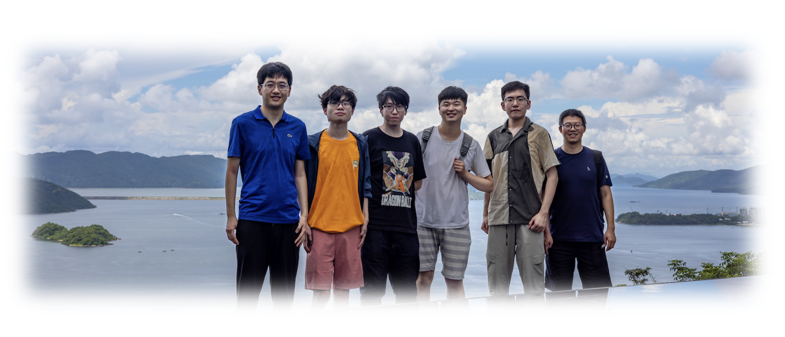
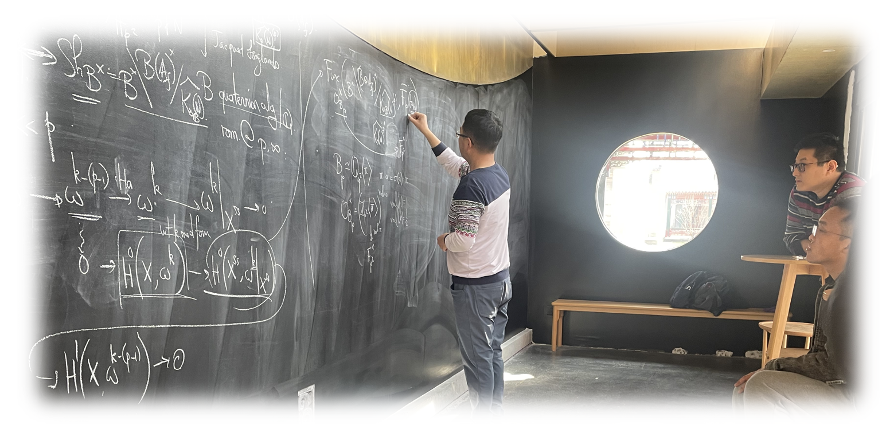

## Articles and Lecture Notes

### Preprints

1. [**Tate Cycles on Unitary Shimura Varieties mod Ramified _p_**]() (in preparation).
2. [**A Geometric Jacquet-Langlands Correspondence for mod _p_ Unitary Shimura Varieties: the Ramified Case**](./blurbs/undergradthesis.pdf), undergraduate thesis (supervisor: [Liang Xiao](https://bicmr.pku.edu.cn/~lxiao/index.htm)), Peking University, 2023.

### Expository Writings and Notes

(_Disclaimer: The following scattered materials are written for studying goals only, and the originality is thus hardly claimed. These notes possibly obtain many major or minor gaps, typos, and logical mistakes due to the note-taker, as well as a lack of references._)

#### Automorphic forms, Shimura varieties, and L-functions:

- [**The Arithmetic of Hilbert Modular Varieties**](./blurbs/Hilb.pdf).  
  _In process._
- [**Chow groups and L-derivatives of automorphic motives for unitary groups**](./blurbs/Li-Liu.pdf).  
  _Based on Chao Li's talk at Columbia in February, 2021; we survey the background of the joint work by Chao Li and Yifeng Liu on Beilinson–Bloch conjecture for unitary Shimura varieties._
- [**Integral Model of Shimura Varieties of Hodge Type**](./blurbs/IntegralModel.pdf) (**Xu Shen**, 2023).  
  _Following Kisin's work on smooth integral models after classification of Breuil-Kisin modules of p-divisible groups._
- [**Higher Dimensional Gross-Zagier Formula**](./blurbs/HigherDimGZ.pdf) (**Wei Zhang**, 2022).  
  _Notes for the Summer School on the Langlands Program (IHES)._
- [**The Local Langlands Conjecture**](./blurbs/LLC.pdf). (**Olivier Taïbi**, 2022)  
  _Notes for the Summer School on the Langlands Program (IHES); revised by the speaker._
- [**Shimura Varieties**](./blurbs/Shvar.pdf) (**Sophie Morel**, 2022).  
  _Notes for the Summer School on the Langlands Program (IHES); revised by the speaker._

#### Geometric aspects of the Langlands program:

- [**On Lusztig's Middle Extension of Perverse Sheaves**](./blurbs/MidExt.pdf).  
  _A survey adapted from some seminar talk about Springer theory._
- [**Local Shtukas and the Langlands Program**](./blurbs/LocalShtukas.pdf) (**Jared Weinstein**, 2022).  
  _Notes for the Summer School on the Langlands Program (IHES)._
- [**On the Local Langlands Conjectures for Reductive Groups over _p_-adic Fields**]().  
  _In process._

#### Galois representations and modular forms:

- [**Modularity Lifting**](./blurbs/modlift.pdf).  
  _The crucial ingredient in understanding Andrew Wiles' proof of Fermat's last theorem; expanded from McGill lecture by Patrick Allen._
- [**Hida Theory on _p_-adic Modular Forms**](./blurbs/Hida.pdf) (**Bin Zhao**, 2022).   
  _About Haruzo Hida's construction of analytic families of ordinary p-adic modular forms and their associated Galois representations._
- [**On the mod _p_ Jacquet-Langlands correspondence for GL(2)**](./blurbs/modpJL.pdf) (**Yongquan Hu**, 2021).  
  _Including basic preliminaries and recent works, such as topics on Serre weight, Gelfand-Kirillov dimension, and Scholze's functor._

#### Representation theory and Reductive groups:

- [**On Representations of Lie Algebras**](./blurbs/Lie.pdf) (**Jinpeng An**, 2022).  
  _Notes for a basic course in routine._

#### Arithmetic geometry, Arakelov geometry, and Algebraic geometry:

- [**Abelian Varieties**](./blurbs/AV2022.pdf).  
  _Following David Mumford's book closely._
- [**Anabelian Geometry and the ABC Conjecture**](./blurbs/AAGABC.pdf).  
  _A review for Shinichi Mochizuki's work; manuscript and totally unreadable._

#### Digressions:

- [**Complex Analysis**](./blurbs/complex.pdf).  
 _Written for the preparation of BICMR PhD Qualification._
- [**Notes on Ratner's Measure Classification Theorem**](./blurbs/Ratner.pdf).  
 _Survey context on homogeneous dynamics and unipotent flows; including Oppenheim conjecture but lack of precision._

  

### Scattered Notes for Research Talks

- [**Robba Site and Robba Cohomology**](./MiniTalks/Shimizu610.pdf) (**Koji Shimizu**, June 10, 2023).  
  _Peking Online International Number Theory Seminar (POINTS), Peking University._
- [**Multivariable (phi,Gamma)-modules and Modular Representations of Galois and GL(2)**](./MiniTalks/Breuil.md) (**Christophe Breuil**, Nov 30, 2022).  
  _?_
- [**Arithmetic of Quadratic Twists of Elliptic Curves**](./MiniTalks/Tian1102.pdf) (**Ye Tian**, Nov 02, 2022).  
  _Distinguished Invited Talk, Tianyuan Mathematical Center._
- [**The _p_-adic Borel Hyperbolicity of Ag**](./MiniTalks/Zhu1019.md) (**Xinwen Zhu**, Oct 19, 2022).  
  _Peking Online International Number Theory Seminar (POINTS), Peking University._
- [**The Landau-Siegel Zero Problem in Number Theory**](./miscellanea/Landau-Siegel.pdf) (**Yitang Zhang**, Nov 15, 2019).  
  _Reflection in public to receiving the Future Science Price, China Future Forum._