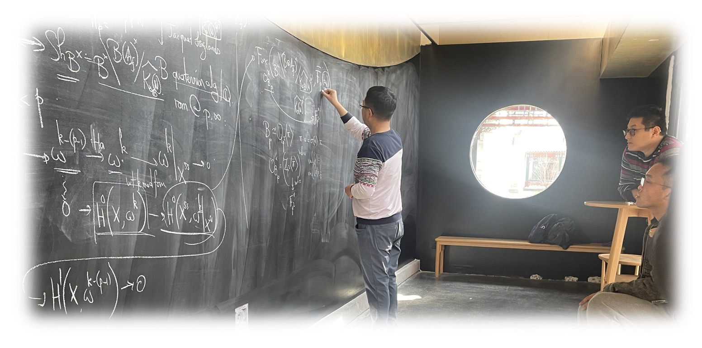

## Papers and Lecture Notes

### Papers

1. [**A Geometric Jacquet-Langlands Correspondence for Unitary Shimura Varieties mod Ramified _p_**](./blurbs/undergradthesis.pdf), undergraduate thesis (supervisor: [Liang Xiao](https://bicmr.pku.edu.cn/~lxiao/index.htm)), Peking University, 2023.

### Expository Writings and Notes

(_Disclaimer: The following scattered materials are written for studying goals only, and the originality is thus hardly claimed. These notes possibly obtain many major or minor gaps, typos, and logical mistakes due to the note-taker, as well as a lack of references._)

#### Automorphic forms, Shimura varieties, and L-functions:

- [**The Hodge-Tate period map on perfectoid Shimura varieties**](./blurbs/HT.pdf) (lectures by **Yihang Zhu**, 2023).  
  _Live-texed notes for a lecture series at YMSC, based on Scholze's torsion paper._
- [**Hyperspherical Hamiltonian varieties**](./blurbs/hamiltonian.pdf).  
  _Notes for two talks on relative Langlands duality._
- [**Chow groups and L-derivatives of automorphic motives for unitary groups**](./blurbs/Li-Liu.pdf).  
  _Based on Chao Li's talk at Columbia in February, 2021; we survey the background of the joint work by Chao Li and Yifeng Liu on Beilinson–Bloch conjecture for unitary Shimura varieties._
- [**Integral Model of Shimura Varieties of Hodge Type**](./blurbs/IntegralModel.pdf) (lectures by **Xu Shen**, 2023).  
  _Following Kisin's work on smooth integral models after classification of Breuil-Kisin modules of p-divisible groups._

#### Geometric aspects of the Langlands program:

- [**On Lusztig's Middle Extension of Perverse Sheaves**](./blurbs/MidExt.pdf).  
  _A survey adapted from some seminar talk about Springer theory._

#### Galois representations and modular forms:

- [**Modularity Lifting**](./blurbs/modlift.pdf) (lectures by **Patrick Allen**, 2022).  
  _The crucial ingredient in understanding Andrew Wiles' proof of Fermat's last theorem; expanded from Allen's McGill lectures._
- [**Hida Theory on _p_-adic Modular Forms**](./blurbs/Hida.pdf) (lectures by **Bin Zhao**, 2022).   
  _About Haruzo Hida's construction of analytic families of ordinary p-adic modular forms and their associated Galois representations._
- [**On the mod _p_ Jacquet-Langlands correspondence for GL(2)**](./blurbs/modpJL.pdf) (lectures by **Yongquan Hu**, 2021).  
  _Including basic preliminaries and recent works, such as topics on Serre weight, Gelfand-Kirillov dimension, and Scholze's functor._

#### Representation theory and Group theory:

- [**On Representations of Lie Algebras**](./blurbs/Lie.pdf) (lectures by **Jinpeng An**, 2022).  
  _Notes for a basic course in routine._

#### Arithmetic geometry, Arakelov geometry, and Algebraic geometry:

- [**Abelian Varieties**](./blurbs/AV2022.pdf).  
  _Following David Mumford's book closely._

#### Digressions:

- [**Complex Analysis**](./blurbs/complex.pdf).  
 _Written for the preparation of BICMR PhD Qualification._
- [**Notes on Ratner's Measure Classification Theorem**](./blurbs/Ratner.pdf).  
 _Survey context on homogeneous dynamics and unipotent flows; including Oppenheim conjecture but lack of precision._

  

