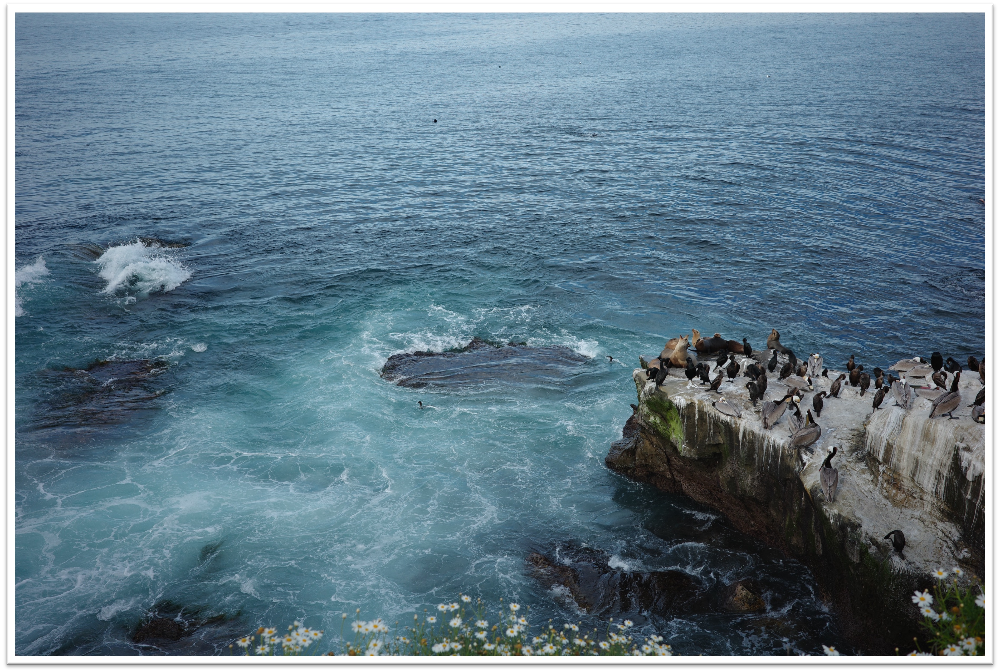

_Last update on: September, 2025._

Hi! 

- [**About Me**](./index.md)
- [**Papers and Notes**](./blurbs.md)
- [**Teaching and Services**](./teaching.md)

 

## Papers and Notes

### Papers

- [**Categorical local Langlands at the Steinberg parameter**]() (joint with [**David Hansen**](http://www.davidrenshawhansen.net)).  
_In preparation_ ([video](https://www.youtube.com/watch?v=oHAwX62Xka0))_._

- [**A geometric Jacquet-Langlands correspondence for unitary Shimura varieties mod ramified _p_**](./blurbs/undergradthesis.pdf).  
_Undergraduate thesis (supervised by [**Liang Xiao**](https://bicmr.pku.edu.cn/~lxiao/index.htm)), Peking University, 2023._  

    La Jolla Cove, San Diego, CA, March 2026

### Notes for Seminar Talks

- [**Stalks of automorphic Vogan sheaves for the Steinberg parameter of GL_n**](./blurbs/St-stalks.pdf).  
  _Notes for talk on [LArGe NEW Seminar](http://www.davidrenshawhansen.net/largenew.html). National University of Singapore, 2025._

- [**Hyperspherical Hamiltonian varieties**](./blurbs/hamiltonian.pdf) (with **Xiangqian Yang**).  
  _Notes for two seminar talks on relative Langlands duality. Peking University, 2023._ 

- [**On Lusztig's middle extension of perverse sheaves**](./blurbs/MidExt.pdf).  
  _A survey adapted from an undergraduate seminar talk about Springer theory. Peking University, 2022._

### Lecture Notes

- [**Introduction to geometric Langlands theory**](./blurbs/LinChenGLC2023.pdf).  
  _Lectures by **Lin Chen**, Tsinghua University, 2024._ 

- [**The Hodge-Tate period map on perfectoid Shimura varieties**](./blurbs/HT.pdf).  
  _Lectures by **Yihang Zhu**, Tsinghua University, 2024. Revised by the lecturer._ 

- [**On the mod _p_ Jacquet-Langlands correspondence for GL_2**](./blurbs/modpJL.pdf).  
  _Lectures by **Yongquan Hu**, Peking University, 2023._

- [**Integral models of Shimura varieties of Hodge type**](./blurbs/ShenIntegralModel.pdf).  
  _Lectures by **Xu Shen**, Peking University, 2023_ 
  (c.f. [**Mark Kisin's lectures**](./blurbs/KisinIntegralModels.pdf) at Clay Mathematical Institute for abelian type).

- [**Modularity lifting**](./blurbs/modlift.pdf).  
  _Lectures by **Patrick Allen**, McGill University, 2022._
  
- [**Complex analysis**](./blurbs/complex.pdf).  
 _Studying notes extended from an undergraduate course by **Jian Xiao**, 2022._

