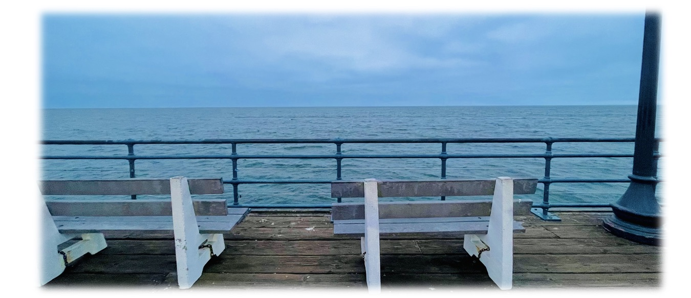

_Last update on: September, 2025._

Hi! 

- [**About Me**](./index.md)
- [**Papers and Notes**](./blurbs.md)
- [**Teaching Works and Services**](./teaching.md)
- [**Archives of Conference / Seminar Activities**](./activities.md)

 

## Papers and Notes

### Papers

1. [**A geometric Jacquet-Langlands correspondence for unitary Shimura varieties mod ramified _p_**](./blurbs/undergradthesis.pdf), undergraduate thesis (supervised by [Liang Xiao](https://bicmr.pku.edu.cn/~lxiao/index.htm)), Peking University, 2023.

    (Photograph by Lingjie Pan) Santa Monica, Los Angeles, CA, 2024

### Notes for Seminar Talks

- [**Stalks of automorphic Vogan sheaves for the Steinberg parameter**](./blurbs/St-stalks.pdf).  
  _Notes for talk on [LArGe NEW Seminar](http://www.davidrenshawhansen.net/largenew.html), National University of Singapore, September 2025._
- [**Hyperspherical Hamiltonian varieties**](./blurbs/hamiltonian.pdf) (with **Xiangqian Yang**).  
  _Notes for two seminar talks on relative Langlands duality, 2023._
- [**On Lusztig's middle extension of perverse sheaves**](./blurbs/MidExt.pdf).  
  _A survey adapted from a seminar talk about Springer theory, 2022._

### Lecture Notes

(_Disclaimer: The following scattered materials are written for studying goals only, and the originality is thus hardly claimed. These notes possibly obtain many major or minor gaps, typos, and logical mistakes due to the note-taker, as well as a lack of references._)

- [**The Hodge-Tate period map on perfectoid Shimura varieties**](./blurbs/HT.pdf).  
  _Notes for lectures by **Yihang Zhu**, Tsinghua University, 2024. Revised by the lecturer._ 
- [**On the mod _p_ Jacquet-Langlands correspondence for GL(2)**](./blurbs/modpJL.pdf).  
  _Notes for lectures by **Yongquan Hu**, Peking University, 2023._
- [**Integral models of Shimura varieties of Hodge type**](./blurbs/ShenIntegralModel.pdf).  
  _Notes for lectures by **Xu Shen**, Peking University, 2023_ 
  (c.f. [**Mark Kisin's lectures**](./blurbs/KisinIntegralModels.pdf) at Clay Mathematical Institute for abelian type).
- [**Modularity lifting**](./blurbs/modlift.pdf).  
  _Notes for lectures by **Patrick Allen**, McGill University, 2022._
- [**Complex analysis**](./blurbs/complex.pdf).  
 _Studying notes extended from a course by **Jian Xiao**, 2022._

### Selected Handwritten Notes

