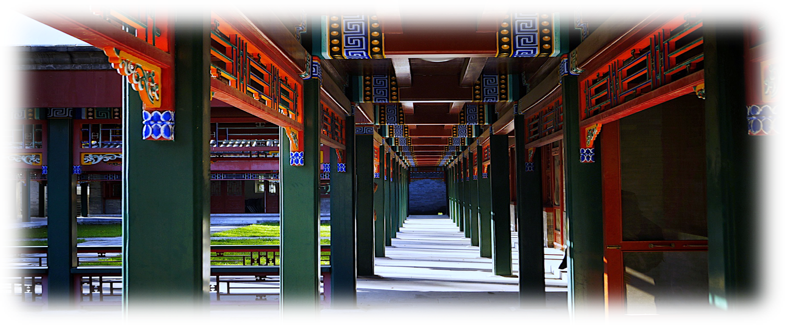

# Wenhan Dai's Homepage / 戴文晗

_Last updated on: February, 2023_

Hi!

### About Me

Now I am an undergraduate student in [School of Mathematical Science](http://english.math.pku.edu.cn) at [Peking University](https://www.pku.edu.cn), China. My research interest includes **number theory**, **arithmetic geometry**, and **representation theory**. My instructor is Professor [Liang Xiao](https://bicmr.pku.edu.cn/~lxiao/index.htm) / 肖梁 at [Beijing International Center for Mathematical Research](https://bicmr.pku.edu.cn). 

During the upcoming 2023-2024, I will be an international exchange student to [École Normale Supérieure Paris-Saclay](https://ens-paris-saclay.com), France; with the support of Chinese Scholarship Council (CSC), I will be under the supervision of Professor [Sophie Morel](https://perso.ens-lyon.fr/sophie.morel/) (she had moved to ENS Lyon from [somewhere else](https://www.math.princeton.edu/people/sophie-morel)). 

A headshot of mine is posted [here](./headshot.jpg).

Regarding language skills: Chinese native speaker; fluent in English and French at work.

## Recent Updates

1. This semester I am working as a teaching assistant of [_Algebraic Geometry II_](./AGII23/AGII23.md).
2. **To be submitted:** [**Modularity lifting**](./miscellanea/modlift.pdf) (Patrick Allen's McGill lectures).
3. **To appear**: **Local Langlands for _p_-adic reductive groups** (a review of Peter Scholze's work).
4. **IMPORTANT:** Notes for [**IHES 2022 Summer School on the Langlands Program**](./IHES22/IHES22.md).


### Ongoing/Upcoming Events

#### 2023 Spring

- [**Geometry of Shimura varieties mod _p_**]().

  Under planing.

- [**Seminar on Lawrence–Venkatesh’s proof of the Mordell conjecture**](./LV23/LV23.md).

  The purpose of this weekly seminar is to study Lawrence–Venkatesh’s proof of the Mordell conjecture. The main reference is [LV], and the survey [Po] gives a quick sketch for beginners. All talks will be given by participants, and each meeting will be about 90 minutes.
  - **Organizer:** [Xinyi Yuan](http://faculty.bicmr.pku.edu.cn/~yxy/).
  - **Time:** 10:30–12:00 Wednesdays (starting on March 1).
  - **Venue:** BICMR 77201.
  
- [**Abelian Varieties (II)**](./AV2/AV2.md) (Student seminar for the 3+X program; see also [**Abelian Varieties (I)**](https://dai-wenhan.github.io/AV/AV.html) during 2022 Fall).

  The goal of this learning seminar is to study the basics of abelian varieties. The pre-requisite is Chapters 2–3 of Hartshorne's algebraic geometry, but this seminar can also be taken while reading Hartshorne's book. Some familiarity with elliptic curves will be helpful to understand some of the materials. Each lecture will be two hours long.
  - **Instructor**: [Liang Xiao](https://bicmr.pku.edu.cn/~lxiao/index.htm).
  - **Time**: Every Saturday, 7:00-9:00pm, during 2023 Spring semester.
  - **Location**: Room 82J12 (Jia-yi-bing Building).


## [Seminars, Workshops, and Conferences Attended](./swc.md)

## [Notes and Expository Papers](./notes.md)

## [School Courses](./courses.md)

## [Teaching Experiences](./teaching.md)


## Contact Info

```
School of Mathematical Science
Peking University
No.5 Yiheyuan Road, Haidian District
Beijing, 100871, China.
```

**Email**: daiwenhan [at] pku [dot] edu [dot] cn (he/him/él/il)
<br/>
Bien que ce site ne soit disponible qu'en anglais, je peux répondre aux courriels en français (avec difficulté).

