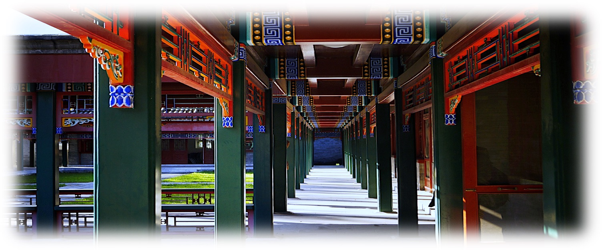

# Wenhan DAI's Homepage / 戴文晗

_Last update on: February, 2024_

Hi!

- [**Papers and Notes**](./blurbs.md).
- [**Conference and Seminar Activities**](./activities.md).
- [**Studying Experiences**](./notes.md).
- [**Teaching Experiences**](./teaching.md).

### About Me

Since 2023 Fall, I am a first-year graduate student at [Yau Mathematical Sciences Center](https://ymsc.tsinghua.edu.cn) (YMSC), China. My research interest includes **number theory**, **arithmetic geometry**, and **(automorphic) representation theory**; I am particularly interested in _p_-adic geometry, categorical local Langlands, and geometric Langlands.

Previously, I got my B.A. in mathematics at [Peking University](https://www.pku.edu.cn) in June 2023. My supervisor was Professor [Liang XIAO](https://bicmr.pku.edu.cn/~lxiao/index.htm) / 肖梁 at [Beijing International Center for Mathematical Research](https://bicmr.pku.edu.cn) (BICMR). 

A headshot of mine is posted [here](./headshot.jpg).

**Regarding language skills:** Chinese native speaker; fluent in English and French at work.


## Recent Updates

1. I will work as the teaching assistant for [Algebraic Number Theory 2](./ANT2-2023Fall/ANT2-2023Fall.md) (Lecturer: Koji Shimizu).


### Ongoing/Upcoming Events

#### 2023 Summer


- [**The 5th _Kyoto+_ Conference on Algebraic Geometry and Arithmetic Geometry at Nanjing**](./Nanjing23/Nanjing23.md).

  By Arithmetic & Homotopic Galois Theory, a France-Japan international network.
  - **Time:** August 24 to 28.
  - **Venue:** Yifu Hall, Nanjing University Gulou / 南京大学鼓楼校区逸夫馆.


## Contact Info

```
School of Mathematical Science
Peking University
No.5 Yiheyuan Road, Haidian District
Beijing, 100871, China
```

```
Yau Mathematical Sciences Center 
Jing Zhai, Tsinghua University
No.30 Shuangqing Road, Haidian District
Beijing, 100084, China
```


**Email:** daiwenhan [at] pku [dot] edu [dot] cn (he/him/él/il) <br/>
 _"Bien que ce site ne soit disponible qu'en anglais, je peux répondre aux courriels en français (avec difficulté)."_


