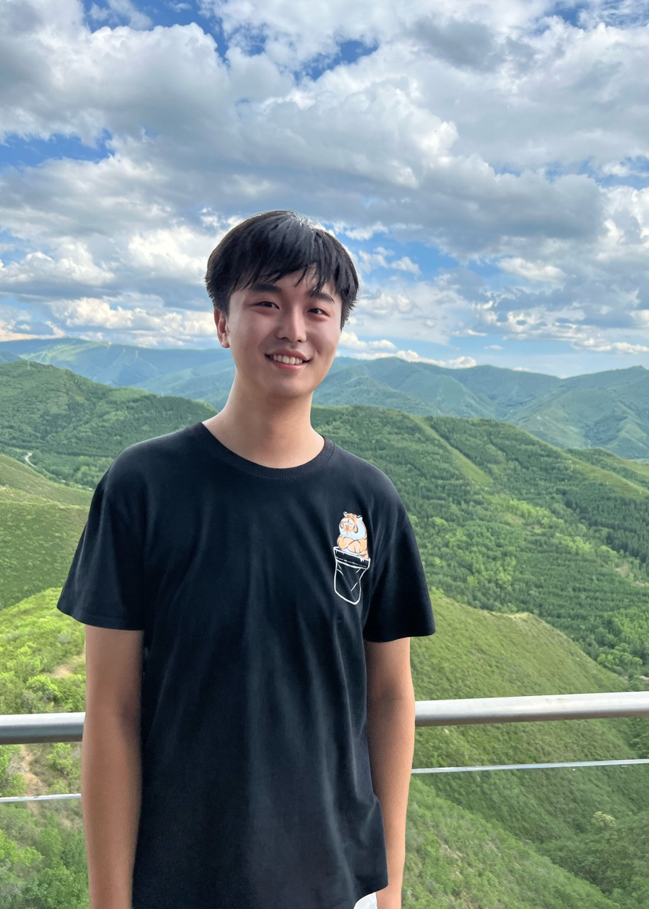

_Last update on: September, 2025._

Hi! 

- [**Papers and Notes**](./blurbs.md)
- [**Conference and Seminar Activities**](./activities.md)
- [**Service and Teaching**](./teaching.md)

<br>


## About Me

 


**Wenhan Dai** **戴文晗** <br>
(_Photo by Xiangqian Yang; Chongli, China, July 2024._)


I am currently a graduate student at [National University of Singapore](https://www.math.nus.edu.sg), where my advisor is [David Hansen](http://www.davidrenshawhansen.net); I spent my previous two academic years 2023 and 2024 at [Qiuzhen Colledge, Tsinghua University](https://qzc.tsinghua.edu.cn/en/), where I was partially advised by [Yihang Zhu](https://yhzhumath.github.io). 

I obtained my B.Sc. in mathematics from [Peking University](https://www.pku.edu.cn) in 2023, supervised by [Liang Xiao](https://bicmr.pku.edu.cn/~lxiao/index.htm). 

I study and work on number theory, arithmetic geometry, and representation theory. Recently, my interest lies in explicit aspects of the **categorical local Langlands correspondence**; I am also broadly interested in **geometric Langlands** and **relative Langlands**. 

Here is my [**CV**](./CV.pdf).

<br>


### Contact Info (he/him/él/il)


```
Department of Mathematics, National University of Singapore
Block S17, 10 Lower Kent Ridge Road
Singapore 119076
```

**Email:** _daiwenhan_ [at] _u_ [dot] _nus_ [dot] _edu_  <br/>
**Regarding language skills:** Chinese native speaker; fluent in English and French at work.

