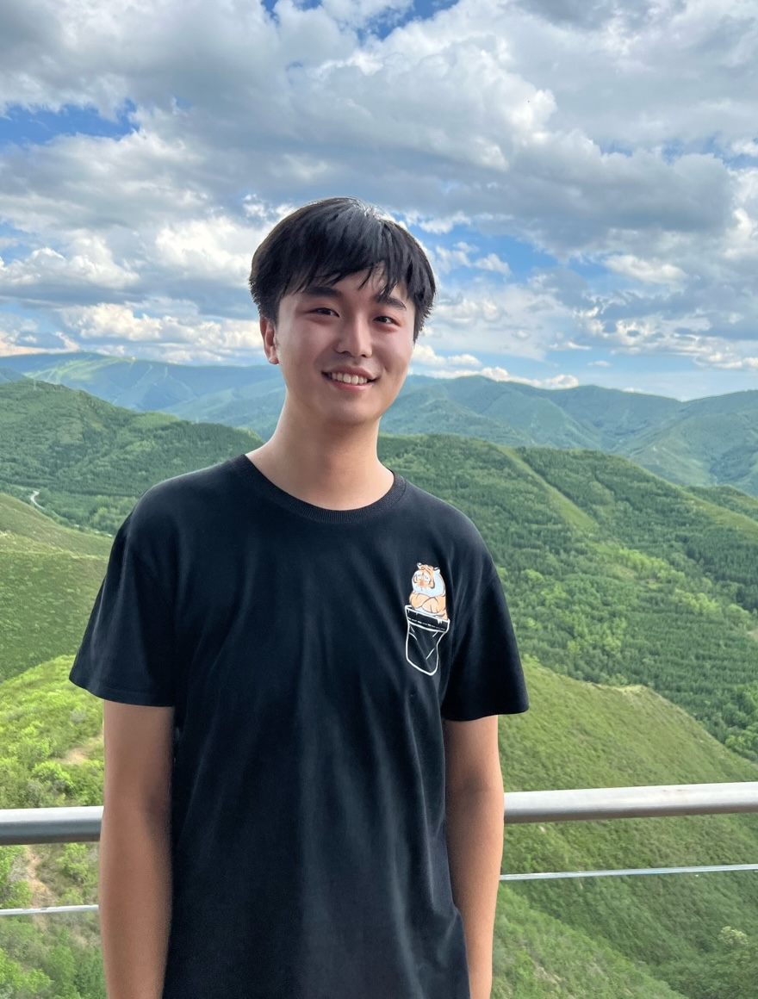

_Last update on: September, 2025._

Hi! 

- [**About Me**](./index.md)
- [**Papers and Notes**](./blurbs.md)
- [**Teaching and Services**](./teaching.md)
- [**Conference & Seminar Archives**](./activities.md)

<br>

## About Me

 


<span style="font-weight: bold; font-size:18px">Wenhan Dai 戴文晗 </span> <br/>
<span style="font-style: italic; font-size:11px; line-height:1">(Photo by Xiangqian Yang; Chongli, China, July 2024)</span>


I am currently a graduate student at [National University of Singapore](https://www.math.nus.edu.sg), where my advisor is [David Hansen](http://www.davidrenshawhansen.net); I spent my previous two academic years 2023 and 2024 at [Qiuzhen College, Tsinghua University](https://qzc.tsinghua.edu.cn/en/), where I was partially advised by [Yihang Zhu](https://yhzhumath.github.io). 

I obtained my B.Sc. in mathematics from [Peking University](https://www.pku.edu.cn) in 2023, supervised by [Liang Xiao](https://bicmr.pku.edu.cn/~lxiao/index.htm). 

I study and work on representation theory, number theory, and algebraic geometry involved in the Langlands program. Recently, my interest lies in explicit aspects of the **categorical local Langlands correspondence**; I am also broadly interested in **geometric Langlands** and **relative Langlands**. 

Here is my [**CV**](./CV.pdf).

<br>


## Contact Info

```
Department of Mathematics, National University of Singapore
Block S17, 10 Lower Kent Ridge Road
Singapore 119076
```

**Email:** _daiwenhan_ [at] _u_ [dot] _nus_ [dot] _edu_ (he/him/él/il). <br/>
**Language skills:** Chinese native speaker; fluent in English and French at work.


<br>


